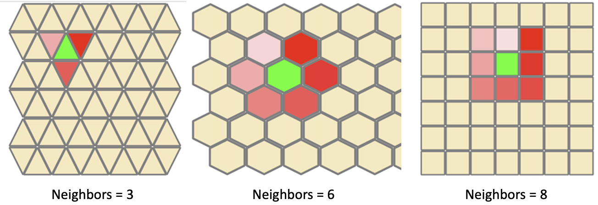

# demoTestNeighbourhood-Model
A simple Cormas demo model where grids with different types of neighbourhood (3, 4, 6 or 8) can be tested and visualised.

Here are 3 examples of grids initialized with 3, 6 and 8 neighbours. At each time step, the focus is put on a cell (with ID = the current time step). It is then colored in green, and its neighbours are colored in a gradient of red (the focused cell changes the state of its neighbours (knowing that, by default, the neighbours are ordered anticlockwise, starting from the North cell):

